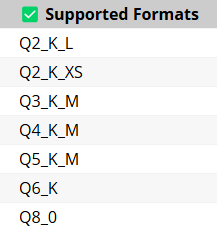

# KTransformers(v0.2) -DeepSeek-R1-671B

## 前言
**[官方文档跳转](https://kvcache-ai.github.io/ktransformers/en/install.html)**

**ktransformers是什么？**
> KTransformers 是一个灵活的、以 Python 为中心的框架，其设计以可扩展性为核心。 通过使用单行代码实现和注入优化的模块，用户可以访问与 Transformers 兼容的 界面、符合 OpenAI 和 Ollama 的 RESTful API，甚至是简化的类似 ChatGPT 的 Web UI。

**ktransformers意义何在？**
> 在以往，运行大参数的LLM需要海量的显卡和显存，而现在[ktransformers](https://github.com/kvcache-ai/ktransformers)框架可以做到使用少量的显存和大规模的内存运行大参数的LLM，这使得低成本运行大参数模型成为了可能，让所有人可以以极低的代价体验到满血的大语言模型，DeepSeek-R1-671B模型就是这个框架的其中一个应用。

**我们需要做什么？**
> 1. 安装基础环境(cuda，NVIDIAToolkit，Python，Pytorch等)
> 2. 拉取ktransformers框架并初始化
> 3. 下载需要运行的大模型，[参考下载地址unsloth/DeepSeek-R1-GGUF](https://modelscope.cn/models/unsloth/DeepSeek-R1-GGUF/files)
> 4. and Just Run It!

## 环境准备

### 配置
- **操作系统**: Ubuntu22.04
- **GPU**: 单卡4090D
- **CPU**:核心线程数越多越优，例如Xeon,EPYC等服务器级别的CPU
- **内存要求**: 512G或者更大，取决于你模型文件大小


### 环境安装
1. **NVIDIA 驱动**
   - cuda版本:12.4 
   - 使用工具安装
      ```bash
      sudo apt install ubuntu-drivers-common
      ubuntu-drivers devices                 #查看推荐驱动版本
      sudo apt install -y nvidia-driver-535  #安装合适版本, nvidia-smi 检查cuda版本
      ```
   - 也可到[官网安装](https://www.nvidia.cn/geforce/drivers/)

2. **NVIDIA Toolkit**
   - 可以参考 [CUDA Toolkit 安装指南](https://developer.nvidia.com/cuda-downloads) 选择对应版本进行安装。
   - Install Type三种都行，选择喜欢的方式，使用 nvcc --version 检查版本
    

3. **编译工具**
   ```bash
   sudo apt-get update
   sudo apt-get install build-essential cmake ninja-build #使用 gcc、g++ 和 cmake 的 Linux-x86_64
   ```
   
4. **Python**
   - Python版本:3.11
   - 使用[Anaconda or Miniconda](https://www.anaconda.com/download/success) 安装管理环境。
   ```bash
   conda create --name ktransformers python=3.11 # 创建一个名为ktransformers的环境
   conda activate ktransformers # 激活ktransformers环境

   # 确保 Anaconda 使用的 GNU C++ 标准库的版本标识符包括 GLIBCXX-3.4.32
   conda install -c conda-forge libstdcxx-ng
   strings ~/anaconda3/envs/ktransformers/lib/libstdc++.so.6 | grep GLIBCXX #验证安装
   ```
   
5. **PyTorch**
   - 安装 PyTorch，确保与 CUDA 版本兼容。
   - 可以参考 [PyTorch 安装指南](https://pytorch.org/get-started/locally/) 进行安装。
     
      ```bash
      #pytorch安装
      pip3 install torch torchvision torchaudio 

      #其余依赖
      pip3 install packaging ninja cpufeature numpy
      pip install flash-attn --no-build-isolation
      ```

### Ktransformers安装
```bash
#克隆仓库并初始化
git clone https://github.com/kvcache-ai/ktransformers.git #注意版本v0.2
cd ktransformers
git submodule init
git submodule update

#对于简单安装
bash install.sh

#对于拥有两个 CPU 的用户：
export USE_NUMA=1
bash install.sh # or `make dev_install`

#对于运行模型时报错Version `GLIBCXX_3.4.30' not found
conda install -c conda-forge libstdcxx-ng
#或者（需要注意你使用anaconda还是miniconda修改路径）
ln -sf /usr/lib/x86_64-linux-gnu/libstdc++.so.6 /home/ad/miniconda3/envs/ktransformers/lib/libstdc++.so.6
```
- 如果想使用ktransformers的[website](https://kvcache-ai.github.io/ktransformers/en/api/server/website.html)一起运行，请在执行 bash install.sh 之前编译 website
- 开发人员可以使用 [makefile](https://kvcache-ai.github.io/ktransformers/en/makefile_usage.html) 来编译和格式化代码
- 当编译成功之后，几乎意味着成功

### 项目预览
- 当一切准备妥当，你的项目结构应该是这个样子，当然你可以用你喜欢的目录名字
```yaml
workspace/           # 项目根目录
├── ktransformers/   # ktransformers框架
├── models/          # 仅仅存放模型文件，不允许出现其他文件
└── config-models/   # 存放对应模型配置文件,该文件在下载开源大模型时可以一并看到，
```
>[配置文件](https://modelscope.cn/models/deepseek-ai/DeepSeek-R1/files)：运行模型需要像config.json，tokenizer.json等这样的非模型文件，注意下载齐全不要遗漏

## 运行

### 启动命令
- **运行本地测试(测速)脚本(此时你应该在ktransformers目录)**
```bash
python -m ktransformers.local_chat --model_path ../config-models --gguf_path ../models
```
- **启动API服务**
```bash
ktransformers --model_path ../config-models --gguf_path ../models --port 10002
```

- **使用内置website**
```bash
ktransformers --model_path ../config-models --gguf_path ../models --port 100022 --web True
#访问地址 http://localhost:10002/web/index.html#/chat
```
### 参数
- --model_path （必需）：模型的配置文件
- --gguf_path （必需）：包含 GGUF 文件的目录路径，即模型文件，且仅能有模型文件
- --max_new_tokens：Int（默认值 = 1000）,要生成的最大新令牌数
- --cpu_infer：Int（默认值 = 10）,用于推理的 CPU 数量。理想情况下应设置为 （内核总数 - 2）
- --force_think:此参数可让R1显示思考过程，官方文档说这个参数要加True值，但实测该参数不需要值
- --optimize_config_path （除 Qwen2Moe 和 DeepSeek-V2 外是必需的):模型会有对应优化文件，可前往ktransformers/optimize/optimize_rules目录查看

### Ktransformers支持模型的模型和量化格式
+ **支持模型**

   
+ **量化格式**

   
